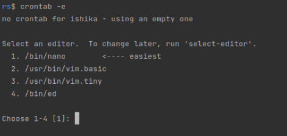

# Scrap data from Stackoverflow

***
Stack overflow website scrapper with PostgreSQL database to store whole scrapped data using Scrapy. 
Scrapy is a python based framework for data scrapping.
***

## Setup

``` 
git clone https://github.com/Ishika101100/ScrapDataFromStackOverflow.git
cd ScrapDataFromStackOverflow/stackoverflow/stackoverflow/spiders
pip install -r requirements.txt
scrapy crawl stackoverflow
```

It should throw errors for database as we have not yet integrated database with it. So let's do that.

### 1. Install Postgres

sudo sh -c 'echo "deb http://apt.postgresql.org/pub/repos/apt $(lsb_release -cs)-pgdg main" >
/etc/apt/sources.list.d/pgdg.list'
wget --quiet -O - https://www.postgresql.org/media/keys/ACCC4CF8.asc | sudo apt-key add
sudo apt-get update
sudo apt-get -y install postgresql # You can define specific version here

Please refer these links for more information

    https://www.postgresql.org/download/linux/ubuntu/	
    https://www.digitalocean.com/community/tutorials/how-to-install-and-use-postgresql-on-ubuntu-18-04

***

### 2 .Creating a database

* You should be able to create a database in postgres using createdb command, the database name you can keep it as you
  want. This database connection details is to be stored in .env file where we will store secrets. This file is in
  gitognore (What's the meaning of adding it in git, It's Top secret ;) )

``` 
DEVELOPMENT_DB_URL='postgresql://{POSTGRES_USER}:{POSTGRES_PASSWORD}@{POSTGRES_SERVER}:{POSTGRES_PORT}/{DATABASE_NAME}'
```

# Packages Used

## Scrapy
Scrapy is a fast high-level web crawling and web scraping framework, used to crawl websites and extract structured data from their pages. It can be used for a wide range of purposes, from data mining to monitoring and automated testing.
- <a href="https://docs.scrapy.org/en/latest/" target="_blank">Package Link</a>

## psycopg2
Psycopg is the most popular PostgreSQL database adapter for the Python programming language. Its main features are the complete implementation of the Python DB API 2.0 specification and the thread safety (several threads can share the same connection).
- <a href="https://pypi.org/project/psycopg2/" target="_blank">Package Link</a>

## scrapy-proxies
This package provides a Scrapy middleware to use rotating proxies, check that they are alive and adjust crawling speed.
- <a href="https://pypi.org/project/scrapy-rotating-proxies/" target="_blank">Package Link</a>


## SQLAlchemy
The SQLAlchemy SQL Toolkit and Object Relational Mapper is a comprehensive set of tools for working with databases and Python. It has several distinct areas of functionality which can be used individually or combined together.
- <a href="https://docs.sqlalchemy.org/en/14/" target="_blank">Package Link</a>

***
# Cron-Job Setup
- Write the following command in terminal
```
crontab -e
```
- If you are corning data for first time you will be asked to select editor



- You can now see editor like this (I selected 1st editor from the list. It may differ from yours)


- Now uncomment cron schedule expression and add according to your requirement
- For example to crawl data in every one minute cron schedule expression will be:
```
***** <Absolute path of .py file>
```


